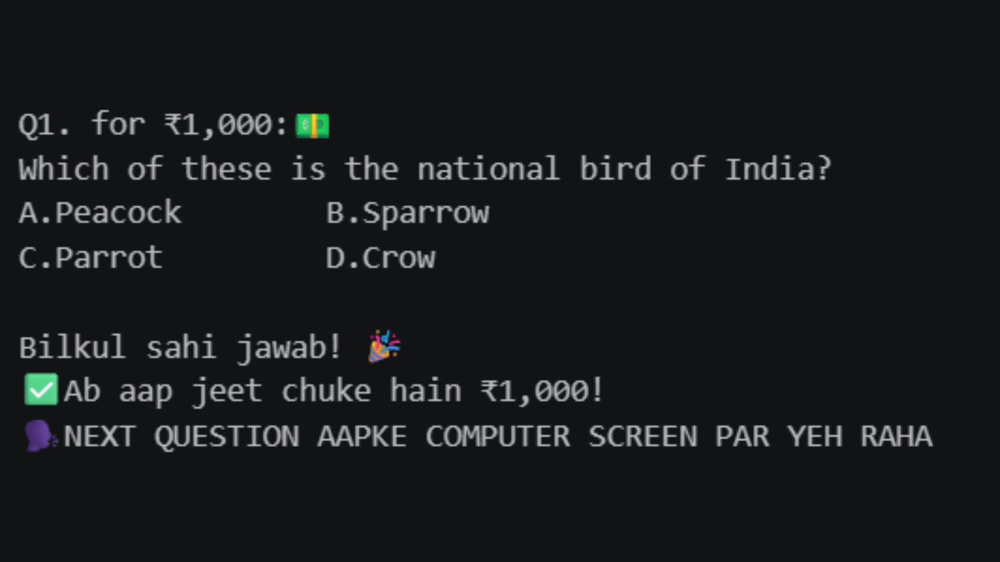
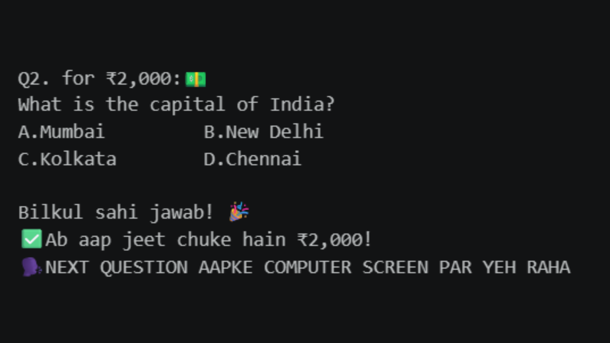
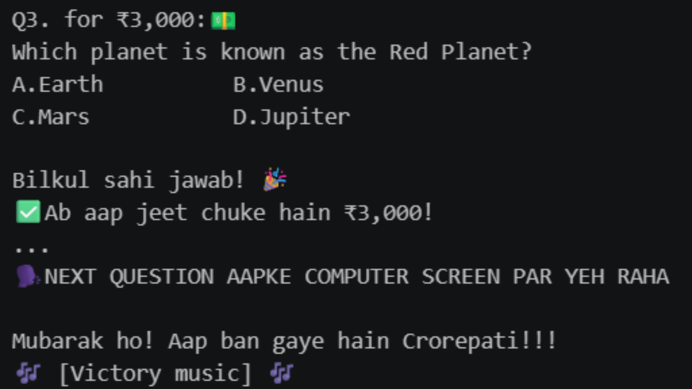

# 🎮 Kaun Banega Crorepati (KBC) - Python Edition

A console based implementation of the popular Indian quiz show **Kaun Banega Crorepati (KBC)** built entirely in Python.

This project recreates the classic KBC gameplay in the terminal, featuring multiple prize levels, randomized questions, and an interactive quiz experience.

> 🚀 **Current Version:** `v1.0`
>
> 🔜 **Upcoming:** A modern web based KBC interface with an improved UI and enhanced gameplay.

---

## ✨ Features

- 🎯 Multiple question levels
- 💰 Progressive prize money system
- 📚 CSV based question bank
- 🔀 Randomized question selection
- ✅ Instant answer validation
- 🎉 Winning and game-over messages

---

## 📸 Screenshots

### Question 1

---

### Question 2

---

### Winning Screen

---

## 🛠️ Built With

- Python
- Pandas
- NumPy
- Jupyter Notebook

---

## 📈 Version History

### ✅ Version 1.0

- Console based KBC game
- Multiple question levels
- Prize money progression
- CSV powered question database
- Randomized gameplay
- Improved terminal experience

---

## 🚀 Planned Features (Version 2)

The next release will focus on improving both the user experience and the overall architecture.

- 🌐 Web based KBC interface
- 🎨 Modern UI inspired by the official show
- ⏱️ Question timer
- 🎵 Background music and sound effects
- 💡 Lifelines (50:50, Audience Poll, Phone-a-Friend)
- 👤 Player profiles
- 🏆 High score leaderboard
- 📱 Responsive design
- 🗄️ Database integration
- ☁️ Online deployment

---

## 👨‍💻Author

**Tushar Kanti Sahariah**